# Lab-Management-System

Scope

● A complete lab booking portal for facilitating booking of IPC Labs and Resources
● Deliverables: Final Web Application
● Functionality:
  ○ Faculty: Consolidated view of all bookings and request booking of a lab
  ○ Student : Consolidated View of all booked and free labs
  ○ Admin: Approve/Cancel/Modify booking request, modify lab details.

Main Features

● Faculty :
  ○ Can View all the booked labs and free labs
  ○ Can View Lab details (various softwares , configurations available in a
    particular lab)
  ○ Can Request to book a particular lab
● Student :
  ○ Can View all the booked and free labs
  ○ Can View Lab details (various softwares , configurations available in a
    particular lab)

Domain and Users

● Domain : University Resources Management / Administration
● Users:
  ○ Operator (Administrator)
  ○ Faculty
  ○ Student

Use Case Stories

● As a faculty, Anil Sir wants to conduct a lab for the subject Computer Networks as part of
  which he wants to give his students hands-on experience of network simulator NS-3. He will
  login to the application with his predefined credentials. He will select NS-3 in the drop down
  list of softwares. He will get a full list of labs where NS-3 is available. Then he can look at the
  free slots for each lab and request a booking at a convenient time. If the booking was
  successful it would show up on the main time table.
● As a student, Vaibhav wants to know where and at what time is the lab of NS-3 going to be
  conducted. He will be able to view the time table and get to know the required details.
  Vaibhav may also want to know a free lab, which he can use for his own purposes. He can do
  so by viewing the main time table through the web application.

Use Case Diagram

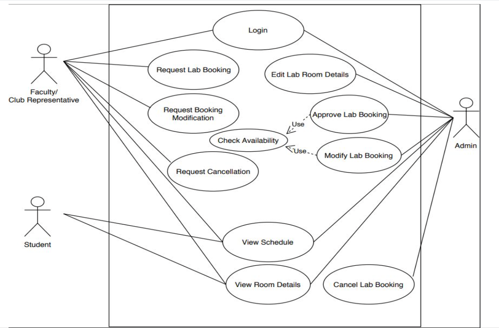

Sequence Diagram - User actor

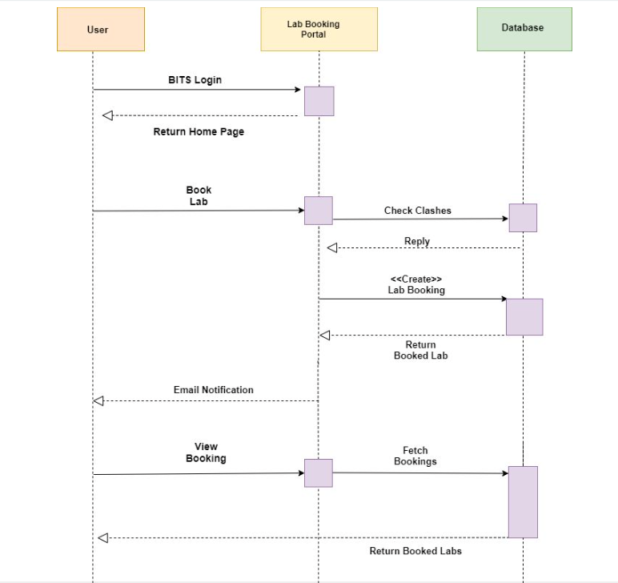

Sequence Diagram - Admin actor

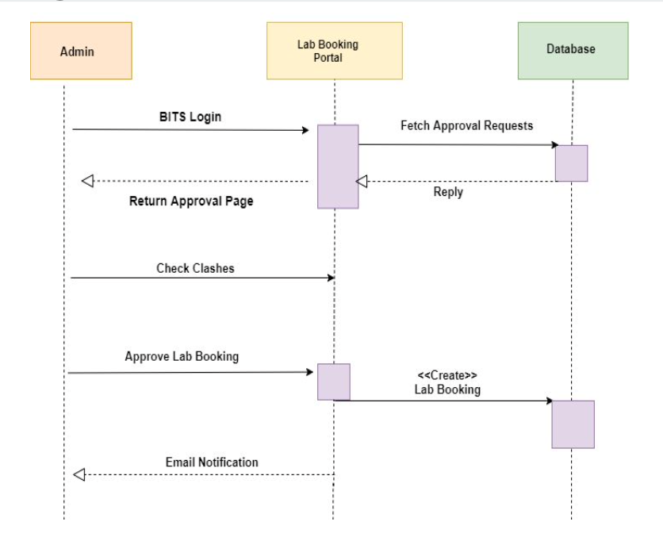

Activity Diagram

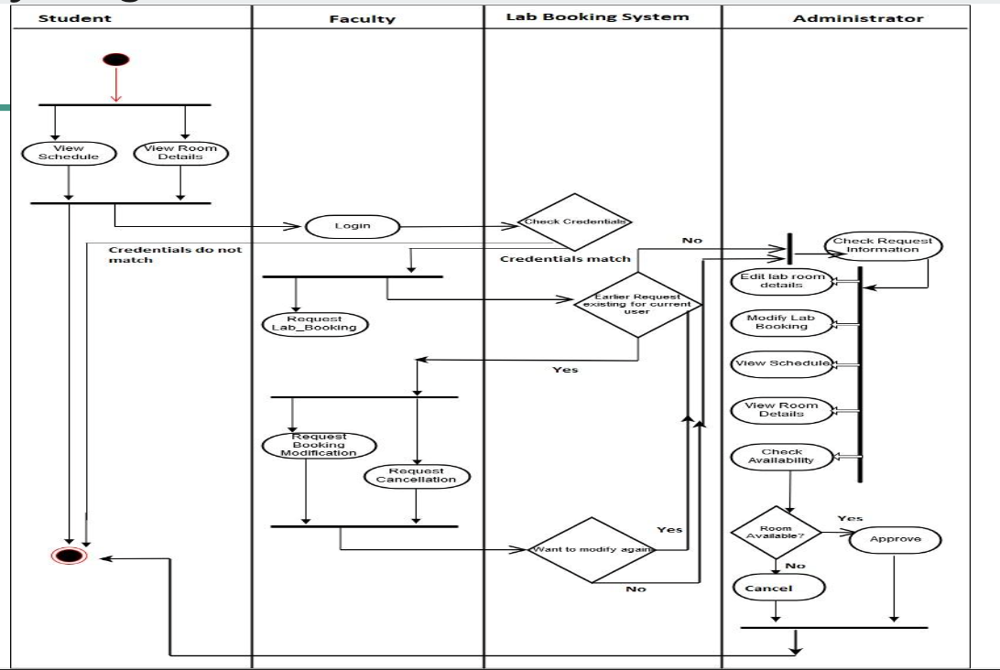

Domain Diagram

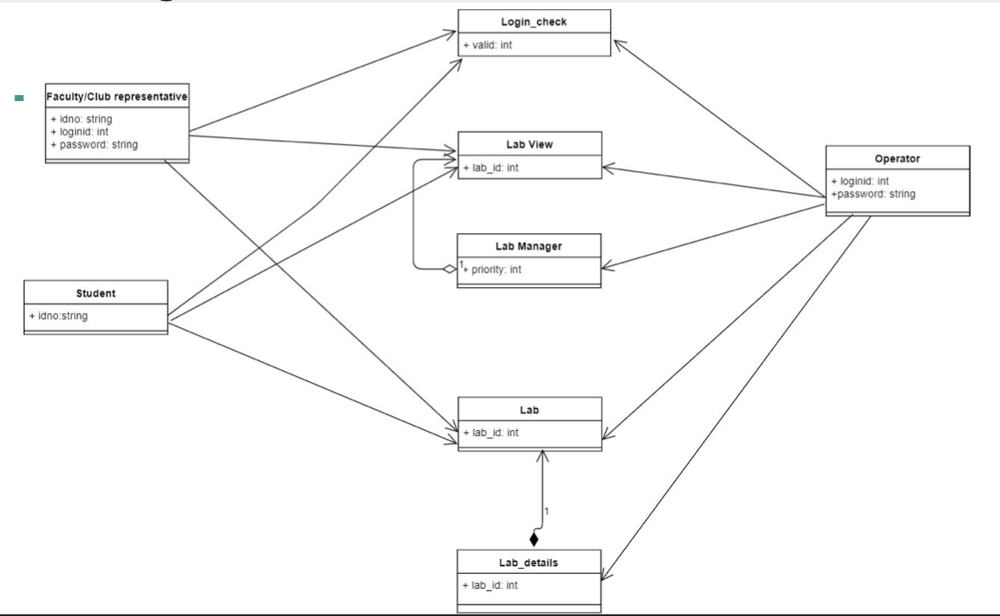

Class Diagram

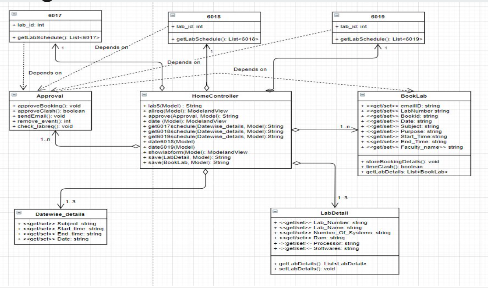

Website Shots

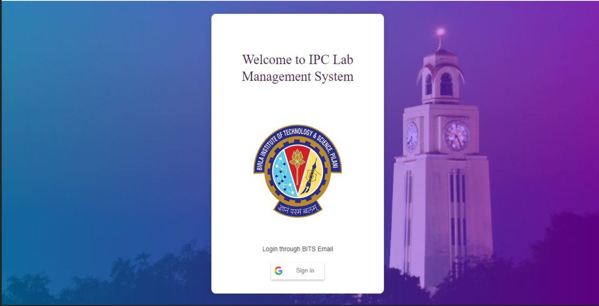
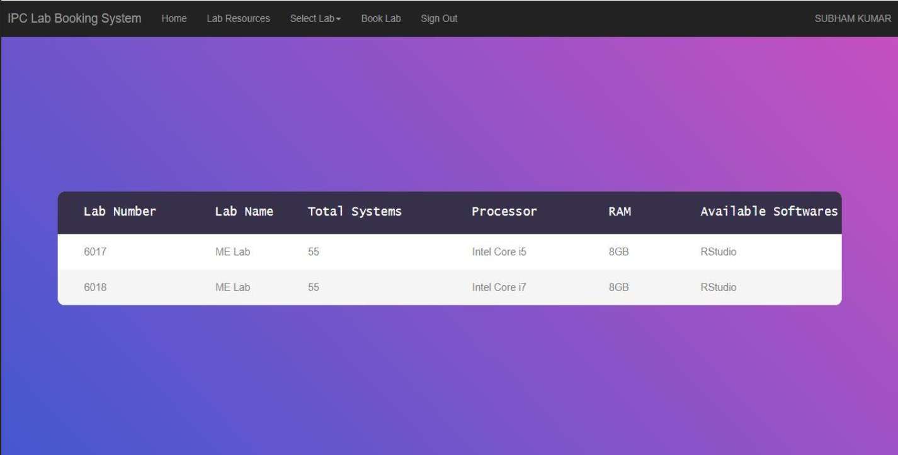
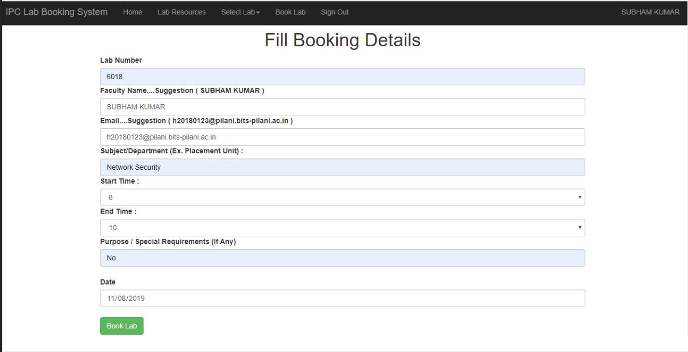
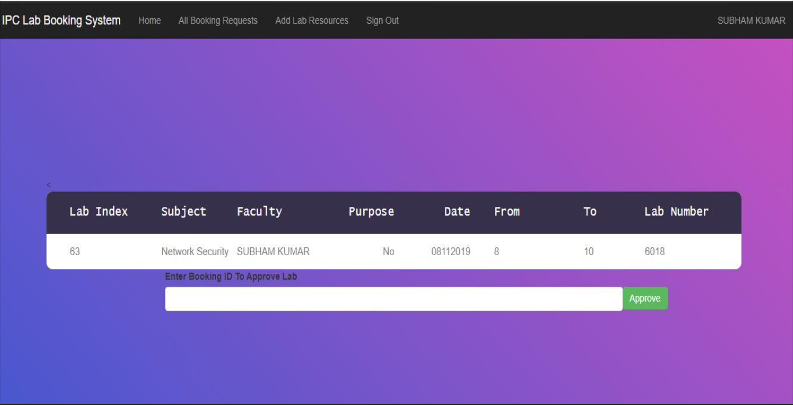
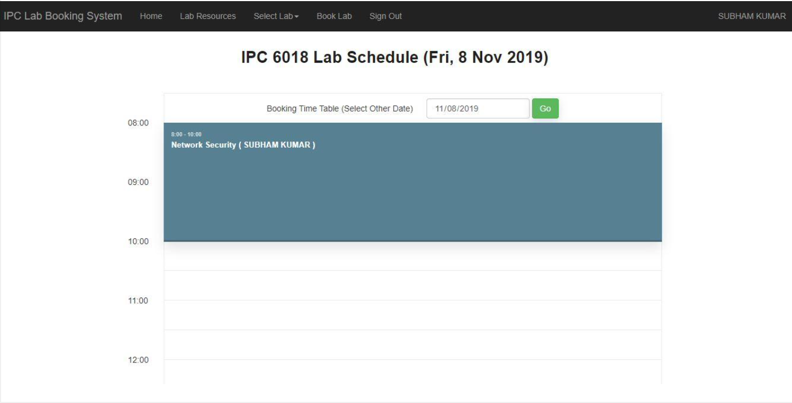
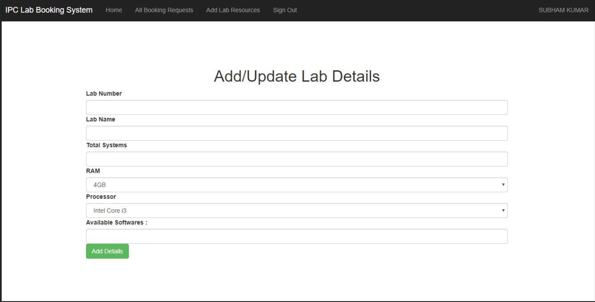
